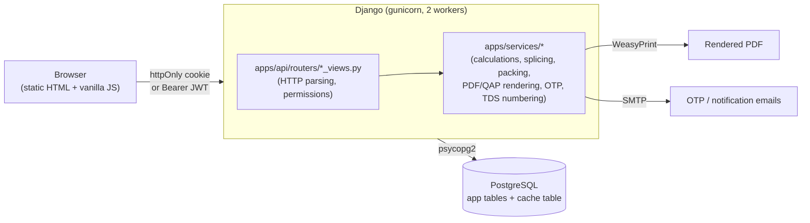
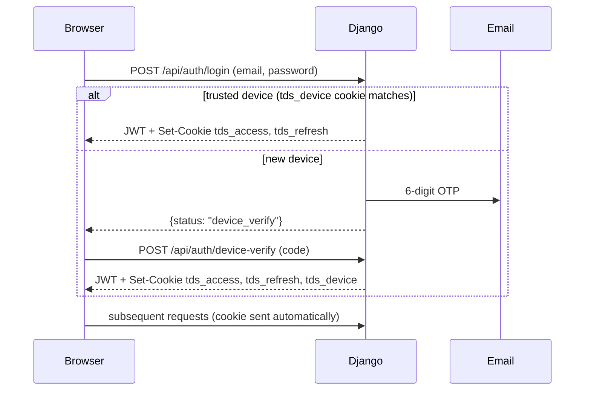

# Architecture

A lightweight map of how the pieces fit together. For command reference and non-obvious
gotchas, see [CLAUDE.md](CLAUDE.md); for setup, see [README.md](README.md).

## Request flow



## Layering rules

- **`apps/core`**: models + migrations only. No views, no business logic.
- **`apps/api/routers/*_views.py`**: HTTP layer — parse the request, check permissions, call a
  service function, shape the response. Do not embed domain math here.
- **`apps/services/*`**: the actual domain logic (belt weight, reel diameter, splice length,
  packing back-calculation, QAP template resolution, PDF rendering, OTP/device-trust, TDS
  numbering). Pure functions where possible — most take plain values, not request objects, so
  they're unit-testable without an HTTP layer (see `apps/services/tests/`).
- **`frontend/`**: static, no build step. `css/style.css` holds only cross-page rules; each page
  layers page-specific CSS in its own `<style>` block. `js/auth.js` has no imports and must load
  first on any authenticated page.

## Data model shape

`TDSInput` (table `tds_inputs`) is the core record — one row per Technical Data Sheet, with FKs
into a set of reference tables that describe the product catalog:

```
Purpose, BeltType, IndusBrand, Standard, CoverGrade, FabricType, FabricStyle, BeltRating
  → resolved into TDSInput's construction fields
ReelType, PackingType, ContainerType, RegionContainerWeightLimit
  → resolved into TDSInput's packing/shipping fields
```

Most of those reference tables are seeded once and rarely change — see `master_views.py`'s
`@cache_page`-wrapped endpoints. `TDSBatch` groups multiple `TDSInput` rows created together
(multi-belt mode); `TDSRevision` snapshots a `TDSInput` row before each edit; `QAPTemplate` →
`QAPSection` → `QAPItem` → `QAPItemSubRow` describe QAP document structure, resolved per-TDS via
`QAPRecord`.

## Auth flow



`tds_access` (12h) and `tds_refresh` (30 days, path-scoped to `/api/auth/`) are httpOnly. A
non-browser API client (script, Postman) can skip cookies entirely and send
`Authorization: Bearer <access_token>` instead — `TDSCookieJWTAuthentication` tries the cookie
first, falls back to the header.

## Known architectural constraints

- **PDF generation is CPU-bound and does not parallelize** under WeasyPrint — measured
  concurrent-request latency scales roughly linearly with concurrency (2 simultaneous PDF
  requests ≈ 2× the single-request time, 10 simultaneous ≈ 10×). Production runs only 2 gunicorn
  worker processes; a burst of concurrent PDF/QAP downloads (e.g. a large "print all" batch) can
  approach gunicorn's 120s timeout. There is no async rendering queue — this is a real capacity
  ceiling to keep in mind before adding features that trigger many PDF renders at once.
- **The Postgres free tier is a single instance** shared by the application tables and the
  cache table (`DatabaseCache`, chosen specifically because it needs no additional
  infrastructure like Redis) — caching reduces read load on it but adds write load for cache
  population/eviction.
